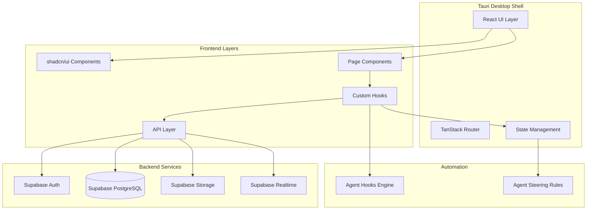
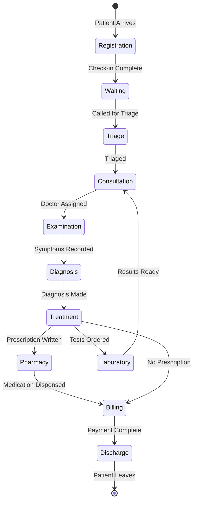

# Hospital Management System - Design Document

## Overview

The Hospital Management System (HMS) is a desktop application built using Tauri for the native shell, React with Vite for the frontend, shadcn/ui for UI components, and Supabase for backend services. The application implements a black and white design theme and provides comprehensive hospital operations management including patient records, appointments, staff management, inventory tracking, and clinical workflows with medical knowledge databases.

### Technology Stack

- **Frontend Framework**: React 18+ with TypeScript
- **Build Tool**: Vite
- **Desktop Framework**: Tauri 2.x
- **UI Components**: shadcn/ui (Radix UI + Tailwind CSS)
- **Backend**: Supabase (PostgreSQL database, Authentication, Storage, Real-time subscriptions)
- **State Management**: Zustand for client state, TanStack Query for server state
- **Form Management**: React Hook Form with Zod validation
- **Routing**: TanStack Router
- **Styling**: Tailwind CSS with black and white theme

## Architecture

### High-Level Architecture



### Application Structure

```
src/
├── main.tsx                 # Application entry point
├── App.tsx                  # Root component with routing
├── components/              # Reusable UI components
│   ├── ui/                 # shadcn/ui components
│   ├── layout/             # Layout components (Sidebar, Header)
│   ├── patients/           # Patient-specific components
│   ├── appointments/       # Appointment components
│   ├── staff/              # Staff management components
│   ├── inventory/          # Inventory components
│   ├── clinical/           # Clinical workflow components
│   ├── flow/               # Patient flow components
│   ├── triage/             # Triage components
│   ├── laboratory/         # Laboratory components
│   ├── pharmacy/           # Pharmacy components
│   ├── billing/            # Billing components
│   └── common/             # Shared components
├── pages/                  # Page components
│   ├── Dashboard.tsx
│   ├── Patients.tsx
│   ├── Appointments.tsx
│   ├── Staff.tsx
│   ├── Inventory.tsx
│   ├── Clinical.tsx
│   ├── PatientFlow.tsx
│   ├── Triage.tsx
│   ├── Laboratory.tsx
│   ├── Pharmacy.tsx
│   ├── Billing.tsx
│   ├── Settings.tsx
│   └── Login.tsx
├── lib/                    # Core libraries and utilities
│   ├── supabase.ts        # Supabase client configuration
│   ├── auth.ts            # Authentication utilities
│   ├── permissions.ts     # Role-based access control
│   └── utils.ts           # Helper functions
├── hooks/                  # Custom React hooks
│   ├── usePatients.ts
│   ├── useAppointments.ts
│   ├── useAuth.ts
│   └── usePermissions.ts
├── stores/                 # Zustand stores
│   ├── authStore.ts
│   └── uiStore.ts
├── types/                  # TypeScript type definitions
│   ├── database.ts        # Supabase generated types
│   ├── models.ts          # Domain models
│   └── enums.ts           # Enums and constants
├── services/              # Business logic services
│   ├── patientService.ts
│   ├── appointmentService.ts
│   ├── clinicalService.ts
│   └── agentService.ts
└── config/                # Configuration files
    ├── routes.ts          # Route definitions
    ├── permissions.ts     # Permission mappings
    └── theme.ts           # Theme configuration
```

## Components and Interfaces

### Core Domain Models

#### Patient Model
```typescript
interface Patient {
  id: string;
  patient_id: string;          // Unique patient identifier
  first_name: string;
  last_name: string;
  date_of_birth: Date;
  gender: 'male' | 'female' | 'other';
  contact_phone: string;
  contact_email?: string;
  address: string;
  emergency_contact_name: string;
  emergency_contact_phone: string;
  blood_type?: string;
  allergies?: string[];
  medical_history?: string;
  created_at: Date;
  updated_at: Date;
  created_by: string;
}
```

#### Appointment Model
```typescript
interface Appointment {
  id: string;
  patient_id: string;
  provider_id: string;         // Staff member (doctor/nurse)
  appointment_date: Date;
  appointment_time: string;
  duration_minutes: number;
  appointment_type: 'consultation' | 'follow-up' | 'emergency' | 'procedure';
  status: 'scheduled' | 'confirmed' | 'in-progress' | 'completed' | 'cancelled';
  notes?: string;
  created_at: Date;
  updated_at: Date;
  created_by: string;
}
```

#### Staff Model
```typescript
interface Staff {
  id: string;
  employee_id: string;
  first_name: string;
  last_name: string;
  role: 'admin' | 'doctor' | 'nurse' | 'receptionist' | 'inventory_manager' | 'viewer';
  department: string;
  specialization?: string;
  contact_phone: string;
  contact_email: string;
  employment_status: 'active' | 'inactive' | 'on_leave';
  hire_date: Date;
  created_at: Date;
  updated_at: Date;
}
```

#### Inventory Model
```typescript
interface InventoryItem {
  id: string;
  item_code: string;
  item_name: string;
  category: 'medical_supplies' | 'equipment' | 'pharmaceuticals' | 'consumables';
  quantity: number;
  unit_of_measure: string;
  reorder_threshold: number;
  unit_cost?: number;
  supplier?: string;
  location?: string;
  expiry_date?: Date;
  created_at: Date;
  updated_at: Date;
}

interface InventoryTransaction {
  id: string;
  item_id: string;
  transaction_type: 'addition' | 'usage' | 'adjustment' | 'disposal';
  quantity_change: number;
  quantity_after: number;
  reason?: string;
  performed_by: string;
  created_at: Date;
}
```

#### Clinical Models

```typescript
interface Symptom {
  id: string;
  symptom_name: string;
  description: string;
  category: 'respiratory' | 'cardiovascular' | 'neurological' | 'gastrointestinal' | 'musculoskeletal' | 'dermatological' | 'other';
  body_system: string;
  severity_levels: string[];
  created_at: Date;
}

interface PatientSymptom {
  id: string;
  patient_id: string;
  visit_id: string;
  symptom_id: string;
  severity: string;
  onset_date?: Date;
  notes?: string;
  recorded_by: string;
  recorded_at: Date;
}

interface Medicine {
  id: string;
  medicine_name: string;
  generic_name: string;
  brand_names: string[];
  dosage_forms: string[];      // tablet, capsule, syrup, injection
  strength_options: string[];  // 500mg, 10ml, etc.
  therapeutic_category: string;
  contraindications?: string[];
  side_effects?: string[];
  drug_interactions?: string[];
  storage_requirements?: string;
  created_at: Date;
}

interface Prescription {
  id: string;
  patient_id: string;
  visit_id: string;
  medicine_id: string;
  dosage: string;
  frequency: string;           // twice daily, every 8 hours
  duration: string;            // 7 days, 2 weeks
  quantity: number;
  special_instructions?: string;
  prescribed_by: string;
  prescribed_at: Date;
  status: 'active' | 'completed' | 'discontinued';
}

interface Diagnosis {
  id: string;
  diagnosis_code: string;      // ICD-10 code
  diagnosis_name: string;
  description: string;
  icd10_category: string;
  created_at: Date;
}

interface PatientDiagnosis {
  id: string;
  patient_id: string;
  visit_id: string;
  diagnosis_id: string;
  severity: 'mild' | 'moderate' | 'severe';
  status: 'suspected' | 'confirmed' | 'resolved' | 'chronic';
  diagnosis_date: Date;
  clinical_notes?: string;
  diagnosed_by: string;
  created_at: Date;
  updated_at: Date;
}

interface PatientVisit {
  id: string;
  patient_id: string;
  provider_id: string;
  visit_date: Date;
  visit_type: 'consultation' | 'follow-up' | 'emergency';
  chief_complaint: string;
  vital_signs?: {
    temperature?: number;
    blood_pressure?: string;
    heart_rate?: number;
    respiratory_rate?: number;
    oxygen_saturation?: number;
  };
  visit_summary?: string;
  follow_up_recommendations?: string;
  created_at: Date;
  updated_at: Date;
}
```

### Permission System

```typescript
enum Permission {
  // Patient permissions
  PATIENT_VIEW = 'patient:view',
  PATIENT_CREATE = 'patient:create',
  PATIENT_UPDATE = 'patient:update',
  PATIENT_DELETE = 'patient:delete',
  
  // Appointment permissions
  APPOINTMENT_VIEW = 'appointment:view',
  APPOINTMENT_CREATE = 'appointment:create',
  APPOINTMENT_UPDATE = 'appointment:update',
  APPOINTMENT_DELETE = 'appointment:delete',
  
  // Staff permissions
  STAFF_VIEW = 'staff:view',
  STAFF_MANAGE = 'staff:manage',
  
  // Inventory permissions
  INVENTORY_VIEW = 'inventory:view',
  INVENTORY_MANAGE = 'inventory:manage',
  
  // Clinical permissions
  CLINICAL_VIEW = 'clinical:view',
  CLINICAL_RECORD = 'clinical:record',
  PRESCRIBE_MEDICINE = 'clinical:prescribe',
  
  // System permissions
  SYSTEM_ADMIN = 'system:admin',
  REPORTS_VIEW = 'reports:view',
  SETTINGS_MANAGE = 'settings:manage',
}

const rolePermissions: Record<string, Permission[]> = {
  admin: [/* all permissions */],
  doctor: [
    Permission.PATIENT_VIEW,
    Permission.PATIENT_UPDATE,
    Permission.APPOINTMENT_VIEW,
    Permission.CLINICAL_VIEW,
    Permission.CLINICAL_RECORD,
    Permission.PRESCRIBE_MEDICINE,
    Permission.REPORTS_VIEW,
  ],
  nurse: [
    Permission.PATIENT_VIEW,
    Permission.PATIENT_UPDATE,
    Permission.APPOINTMENT_VIEW,
    Permission.CLINICAL_VIEW,
    Permission.CLINICAL_RECORD,
  ],
  receptionist: [
    Permission.PATIENT_VIEW,
    Permission.PATIENT_CREATE,
    Permission.PATIENT_UPDATE,
    Permission.APPOINTMENT_VIEW,
    Permission.APPOINTMENT_CREATE,
    Permission.APPOINTMENT_UPDATE,
  ],
  inventory_manager: [
    Permission.INVENTORY_VIEW,
    Permission.INVENTORY_MANAGE,
    Permission.REPORTS_VIEW,
  ],
  viewer: [
    Permission.PATIENT_VIEW,
    Permission.APPOINTMENT_VIEW,
    Permission.STAFF_VIEW,
    Permission.INVENTORY_VIEW,
    Permission.CLINICAL_VIEW,
    Permission.REPORTS_VIEW,
  ],
};
```

### Agent Hooks System

```typescript
interface AgentHook {
  id: string;
  name: string;
  description: string;
  event_type: 'patient.created' | 'patient.updated' | 'appointment.created' | 'inventory.low_stock';
  enabled: boolean;
  action_type: 'validate' | 'notify' | 'generate_recommendation';
  configuration: Record<string, any>;
  created_at: Date;
  updated_at: Date;
}

interface HookExecution {
  id: string;
  hook_id: string;
  triggered_at: Date;
  event_data: Record<string, any>;
  result: 'success' | 'failure';
  output?: any;
  error_message?: string;
}
```

### Agent Steering Configuration

```typescript
interface SteeringRule {
  id: string;
  name: string;
  description: string;
  rule_type: 'validation' | 'formatting' | 'policy';
  applies_to: 'patient' | 'appointment' | 'inventory' | 'clinical';
  conditions?: {
    role?: string[];
    context?: string;
  };
  rule_definition: Record<string, any>;
  enabled: boolean;
  created_at: Date;
}
```

## Data Models

### Supabase Database Schema

```sql
-- Enable UUID extension
CREATE EXTENSION IF NOT EXISTS "uuid-ossp";

-- Patients table
CREATE TABLE patients (
  id UUID PRIMARY KEY DEFAULT uuid_generate_v4(),
  patient_id VARCHAR(50) UNIQUE NOT NULL,
  first_name VARCHAR(100) NOT NULL,
  last_name VARCHAR(100) NOT NULL,
  date_of_birth DATE NOT NULL,
  gender VARCHAR(20) NOT NULL,
  contact_phone VARCHAR(20) NOT NULL,
  contact_email VARCHAR(100),
  address TEXT NOT NULL,
  emergency_contact_name VARCHAR(100) NOT NULL,
  emergency_contact_phone VARCHAR(20) NOT NULL,
  blood_type VARCHAR(10),
  allergies TEXT[],
  medical_history TEXT,
  created_at TIMESTAMP WITH TIME ZONE DEFAULT NOW(),
  updated_at TIMESTAMP WITH TIME ZONE DEFAULT NOW(),
  created_by UUID REFERENCES auth.users(id)
);

-- Appointments table
CREATE TABLE appointments (
  id UUID PRIMARY KEY DEFAULT uuid_generate_v4(),
  patient_id UUID REFERENCES patients(id) ON DELETE CASCADE,
  provider_id UUID REFERENCES staff(id),
  appointment_date DATE NOT NULL,
  appointment_time TIME NOT NULL,
  duration_minutes INTEGER DEFAULT 30,
  appointment_type VARCHAR(50) NOT NULL,
  status VARCHAR(50) DEFAULT 'scheduled',
  notes TEXT,
  created_at TIMESTAMP WITH TIME ZONE DEFAULT NOW(),
  updated_at TIMESTAMP WITH TIME ZONE DEFAULT NOW(),
  created_by UUID REFERENCES auth.users(id)
);

-- Staff table
CREATE TABLE staff (
  id UUID PRIMARY KEY DEFAULT uuid_generate_v4(),
  user_id UUID REFERENCES auth.users(id) UNIQUE,
  employee_id VARCHAR(50) UNIQUE NOT NULL,
  first_name VARCHAR(100) NOT NULL,
  last_name VARCHAR(100) NOT NULL,
  role VARCHAR(50) NOT NULL,
  department VARCHAR(100) NOT NULL,
  specialization VARCHAR(100),
  contact_phone VARCHAR(20) NOT NULL,
  contact_email VARCHAR(100) NOT NULL,
  employment_status VARCHAR(50) DEFAULT 'active',
  hire_date DATE NOT NULL,
  created_at TIMESTAMP WITH TIME ZONE DEFAULT NOW(),
  updated_at TIMESTAMP WITH TIME ZONE DEFAULT NOW()
);

-- Inventory items table
CREATE TABLE inventory_items (
  id UUID PRIMARY KEY DEFAULT uuid_generate_v4(),
  item_code VARCHAR(50) UNIQUE NOT NULL,
  item_name VARCHAR(200) NOT NULL,
  category VARCHAR(50) NOT NULL,
  quantity INTEGER NOT NULL DEFAULT 0,
  unit_of_measure VARCHAR(50) NOT NULL,
  reorder_threshold INTEGER NOT NULL,
  unit_cost DECIMAL(10, 2),
  supplier VARCHAR(200),
  location VARCHAR(100),
  expiry_date DATE,
  created_at TIMESTAMP WITH TIME ZONE DEFAULT NOW(),
  updated_at TIMESTAMP WITH TIME ZONE DEFAULT NOW()
);

-- Inventory transactions table
CREATE TABLE inventory_transactions (
  id UUID PRIMARY KEY DEFAULT uuid_generate_v4(),
  item_id UUID REFERENCES inventory_items(id) ON DELETE CASCADE,
  transaction_type VARCHAR(50) NOT NULL,
  quantity_change INTEGER NOT NULL,
  quantity_after INTEGER NOT NULL,
  reason TEXT,
  performed_by UUID REFERENCES auth.users(id),
  created_at TIMESTAMP WITH TIME ZONE DEFAULT NOW()
);

-- Symptoms table
CREATE TABLE symptoms (
  id UUID PRIMARY KEY DEFAULT uuid_generate_v4(),
  symptom_name VARCHAR(200) NOT NULL,
  description TEXT,
  category VARCHAR(50) NOT NULL,
  body_system VARCHAR(100),
  severity_levels TEXT[],
  created_at TIMESTAMP WITH TIME ZONE DEFAULT NOW()
);

-- Patient symptoms table
CREATE TABLE patient_symptoms (
  id UUID PRIMARY KEY DEFAULT uuid_generate_v4(),
  patient_id UUID REFERENCES patients(id) ON DELETE CASCADE,
  visit_id UUID REFERENCES patient_visits(id) ON DELETE CASCADE,
  symptom_id UUID REFERENCES symptoms(id),
  severity VARCHAR(50),
  onset_date DATE,
  notes TEXT,
  recorded_by UUID REFERENCES auth.users(id),
  recorded_at TIMESTAMP WITH TIME ZONE DEFAULT NOW()
);

-- Medicines table
CREATE TABLE medicines (
  id UUID PRIMARY KEY DEFAULT uuid_generate_v4(),
  medicine_name VARCHAR(200) NOT NULL,
  generic_name VARCHAR(200) NOT NULL,
  brand_names TEXT[],
  dosage_forms TEXT[],
  strength_options TEXT[],
  therapeutic_category VARCHAR(100),
  contraindications TEXT[],
  side_effects TEXT[],
  drug_interactions TEXT[],
  storage_requirements TEXT,
  created_at TIMESTAMP WITH TIME ZONE DEFAULT NOW()
);

-- Prescriptions table
CREATE TABLE prescriptions (
  id UUID PRIMARY KEY DEFAULT uuid_generate_v4(),
  patient_id UUID REFERENCES patients(id) ON DELETE CASCADE,
  visit_id UUID REFERENCES patient_visits(id) ON DELETE CASCADE,
  medicine_id UUID REFERENCES medicines(id),
  dosage VARCHAR(100) NOT NULL,
  frequency VARCHAR(100) NOT NULL,
  duration VARCHAR(100) NOT NULL,
  quantity INTEGER NOT NULL,
  special_instructions TEXT,
  prescribed_by UUID REFERENCES auth.users(id),
  prescribed_at TIMESTAMP WITH TIME ZONE DEFAULT NOW(),
  status VARCHAR(50) DEFAULT 'active'
);

-- Diagnoses table
CREATE TABLE diagnoses (
  id UUID PRIMARY KEY DEFAULT uuid_generate_v4(),
  diagnosis_code VARCHAR(20) NOT NULL,
  diagnosis_name VARCHAR(200) NOT NULL,
  description TEXT,
  icd10_category VARCHAR(100),
  created_at TIMESTAMP WITH TIME ZONE DEFAULT NOW()
);

-- Patient diagnoses table
CREATE TABLE patient_diagnoses (
  id UUID PRIMARY KEY DEFAULT uuid_generate_v4(),
  patient_id UUID REFERENCES patients(id) ON DELETE CASCADE,
  visit_id UUID REFERENCES patient_visits(id) ON DELETE CASCADE,
  diagnosis_id UUID REFERENCES diagnoses(id),
  severity VARCHAR(50),
  status VARCHAR(50) NOT NULL,
  diagnosis_date DATE NOT NULL,
  clinical_notes TEXT,
  diagnosed_by UUID REFERENCES auth.users(id),
  created_at TIMESTAMP WITH TIME ZONE DEFAULT NOW(),
  updated_at TIMESTAMP WITH TIME ZONE DEFAULT NOW()
);

-- Patient visits table
CREATE TABLE patient_visits (
  id UUID PRIMARY KEY DEFAULT uuid_generate_v4(),
  patient_id UUID REFERENCES patients(id) ON DELETE CASCADE,
  provider_id UUID REFERENCES staff(id),
  visit_date TIMESTAMP WITH TIME ZONE NOT NULL,
  visit_type VARCHAR(50) NOT NULL,
  chief_complaint TEXT NOT NULL,
  vital_signs JSONB,
  visit_summary TEXT,
  follow_up_recommendations TEXT,
  created_at TIMESTAMP WITH TIME ZONE DEFAULT NOW(),
  updated_at TIMESTAMP WITH TIME ZONE DEFAULT NOW()
);

-- Agent hooks table
CREATE TABLE agent_hooks (
  id UUID PRIMARY KEY DEFAULT uuid_generate_v4(),
  name VARCHAR(200) NOT NULL,
  description TEXT,
  event_type VARCHAR(100) NOT NULL,
  enabled BOOLEAN DEFAULT true,
  action_type VARCHAR(100) NOT NULL,
  configuration JSONB,
  created_at TIMESTAMP WITH TIME ZONE DEFAULT NOW(),
  updated_at TIMESTAMP WITH TIME ZONE DEFAULT NOW()
);

-- Hook executions table
CREATE TABLE hook_executions (
  id UUID PRIMARY KEY DEFAULT uuid_generate_v4(),
  hook_id UUID REFERENCES agent_hooks(id) ON DELETE CASCADE,
  triggered_at TIMESTAMP WITH TIME ZONE DEFAULT NOW(),
  event_data JSONB,
  result VARCHAR(50) NOT NULL,
  output JSONB,
  error_message TEXT
);

-- Steering rules table
CREATE TABLE steering_rules (
  id UUID PRIMARY KEY DEFAULT uuid_generate_v4(),
  name VARCHAR(200) NOT NULL,
  description TEXT,
  rule_type VARCHAR(50) NOT NULL,
  applies_to VARCHAR(50) NOT NULL,
  conditions JSONB,
  rule_definition JSONB NOT NULL,
  enabled BOOLEAN DEFAULT true,
  created_at TIMESTAMP WITH TIME ZONE DEFAULT NOW()
);

-- Indexes for performance
CREATE INDEX idx_patients_patient_id ON patients(patient_id);
CREATE INDEX idx_patients_name ON patients(last_name, first_name);
CREATE INDEX idx_appointments_date ON appointments(appointment_date);
CREATE INDEX idx_appointments_patient ON appointments(patient_id);
CREATE INDEX idx_appointments_provider ON appointments(provider_id);
CREATE INDEX idx_staff_role ON staff(role);
CREATE INDEX idx_inventory_category ON inventory_items(category);
CREATE INDEX idx_patient_visits_patient ON patient_visits(patient_id);
CREATE INDEX idx_prescriptions_patient ON prescriptions(patient_id);
CREATE INDEX idx_patient_diagnoses_patient ON patient_diagnoses(patient_id);
```

### Row Level Security (RLS) Policies

Supabase RLS policies will enforce role-based access control at the database level:

```sql
-- Enable RLS on all tables
ALTER TABLE patients ENABLE ROW LEVEL SECURITY;
ALTER TABLE appointments ENABLE ROW LEVEL SECURITY;
ALTER TABLE staff ENABLE ROW LEVEL SECURITY;
-- ... enable for all tables

-- Example policies for patients table
CREATE POLICY "Admins can do everything on patients"
  ON patients FOR ALL
  USING (auth.jwt() ->> 'role' = 'admin');

CREATE POLICY "Doctors can view and update patients"
  ON patients FOR SELECT
  USING (auth.jwt() ->> 'role' IN ('doctor', 'nurse', 'receptionist', 'viewer'));

CREATE POLICY "Doctors can update patients"
  ON patients FOR UPDATE
  USING (auth.jwt() ->> 'role' IN ('doctor', 'nurse', 'receptionist'));

CREATE POLICY "Receptionists can create patients"
  ON patients FOR INSERT
  WITH CHECK (auth.jwt() ->> 'role' IN ('admin', 'receptionist'));
```

## Error Handling

### Error Types

```typescript
enum ErrorType {
  VALIDATION_ERROR = 'VALIDATION_ERROR',
  AUTHENTICATION_ERROR = 'AUTHENTICATION_ERROR',
  AUTHORIZATION_ERROR = 'AUTHORIZATION_ERROR',
  NETWORK_ERROR = 'NETWORK_ERROR',
  DATABASE_ERROR = 'DATABASE_ERROR',
  NOT_FOUND_ERROR = 'NOT_FOUND_ERROR',
  CONFLICT_ERROR = 'CONFLICT_ERROR',
}

interface AppError {
  type: ErrorType;
  message: string;
  details?: any;
  timestamp: Date;
}
```

### Error Handling Strategy

1. **Form Validation**: Use Zod schemas with React Hook Form for client-side validation
2. **API Errors**: Catch and transform Supabase errors into user-friendly messages
3. **Network Errors**: Display retry options and cache data locally when offline
4. **Permission Errors**: Redirect to appropriate pages with clear error messages
5. **Toast Notifications**: Use shadcn/ui toast component for error feedback

## Testing Strategy

### Unit Testing
- Test utility functions and business logic
- Test custom hooks with React Testing Library
- Test form validation schemas
- Test permission checking logic

### Integration Testing
- Test API service layer with mocked Supabase client
- Test component interactions with user events
- Test routing and navigation flows

### E2E Testing
- Test critical user workflows (patient registration, appointment scheduling)
- Test authentication and authorization flows
- Test clinical workflow from symptoms to prescription

### Testing Tools
- **Unit/Integration**: Vitest + React Testing Library
- **E2E**: Playwright
- **Mocking**: MSW (Mock Service Worker) for API mocking

## Dark Theme Configuration

```typescript
// tailwind.config.js
export default {
  theme: {
    extend: {
      colors: {
        // Base colors
        'rich-black': '#0f131a',      // Primary background
        'gunmetal': '#232c3d',         // Secondary background
        'prussian-blue': '#273043',    // Tertiary background
        'cool-gray': '#9197ae',        // Muted text
        'mint-cream': '#eff6ee',       // Primary text
        'imperial-red': '#f02d3a',     // Error/destructive
        'rojo': '#dd0426',             // Error dark
        
        // Semantic color mapping
        background: '#0f131a',         // Rich black
        foreground: '#eff6ee',         // Mint cream
        card: '#232c3d',               // Gunmetal
        'card-foreground': '#eff6ee',  // Mint cream
        popover: '#273043',            // Prussian blue
        'popover-foreground': '#eff6ee', // Mint cream
        primary: '#273043',            // Prussian blue
        'primary-foreground': '#eff6ee', // Mint cream
        secondary: '#232c3d',          // Gunmetal
        'secondary-foreground': '#eff6ee', // Mint cream
        muted: '#232c3d',              // Gunmetal
        'muted-foreground': '#9197ae', // Cool gray
        accent: '#273043',             // Prussian blue
        'accent-foreground': '#eff6ee', // Mint cream
        destructive: '#f02d3a',        // Imperial red
        'destructive-foreground': '#eff6ee', // Mint cream
        border: '#273043',             // Prussian blue
        input: '#232c3d',              // Gunmetal
        ring: '#9197ae',               // Cool gray
        
        // Additional utility colors
        success: '#10b981',            // Green for success states
        warning: '#f59e0b',            // Amber for warnings
        info: '#3b82f6',               // Blue for info
      },
      fontFamily: {
        sans: ['Inter', 'Mona Sans', 'Poppins', 'system-ui', 'sans-serif'],
        heading: ['Mona Sans', 'Inter', 'Poppins', 'system-ui', 'sans-serif'],
        body: ['Inter', 'Poppins', 'system-ui', 'sans-serif'],
      },
    },
  },
};
```

### Color Usage Guidelines

- **Rich Black (#0f131a)**: Main application background, provides deep contrast
- **Gunmetal (#232c3d)**: Card backgrounds, secondary surfaces, input fields
- **Prussian Blue (#273043)**: Hover states, borders, primary buttons
- **Cool Gray (#9197ae)**: Secondary text, muted content, disabled states
- **Mint Cream (#eff6ee)**: Primary text, headings, high-contrast content
- **Imperial Red (#f02d3a)**: Error messages, destructive actions, alerts
- **Rojo (#dd0426)**: Error hover states, critical warnings

### Accessibility Considerations

The color palette provides excellent contrast ratios:
- Mint Cream on Rich Black: 15.8:1 (AAA compliant)
- Mint Cream on Gunmetal: 11.2:1 (AAA compliant)
- Cool Gray on Rich Black: 6.8:1 (AA compliant)

This ensures readability in clinical environments with varying lighting conditions.

### Font Usage Guidelines

- **Primary Font (Inter)**: Use for body text, forms, tables, and general UI elements
- **Heading Font (Mona Sans)**: Use for page titles, section headings, and navigation
- **Alternative Font (Poppins)**: Use for buttons, labels, and emphasis text

### Font Loading

```typescript
// Add to index.html or main CSS file
@import url('https://fonts.googleapis.com/css2?family=Inter:wght@300;400;500;600;700&display=swap');
@import url('https://fonts.googleapis.com/css2?family=Poppins:wght@300;400;500;600;700&display=swap');

// Mona Sans should be loaded from GitHub or local files
@font-face {
  font-family: 'Mona Sans';
  src: url('/fonts/Mona-Sans.woff2') format('woff2');
  font-weight: 200 900;
  font-stretch: 75% 125%;
}
```

## Performance Considerations

1. **Pagination**: Implement cursor-based pagination for large datasets (20 items per page)
2. **Lazy Loading**: Use React.lazy() for route-based code splitting
3. **Query Optimization**: Use TanStack Query for caching and background refetching
4. **Debouncing**: Debounce search inputs to reduce API calls
5. **Virtual Scrolling**: Use virtual scrolling for large lists (e.g., patient records)
6. **Optimistic Updates**: Implement optimistic UI updates for better perceived performance

## Security Considerations

1. **Authentication**: Supabase Auth with email/password and session management
2. **Authorization**: Row Level Security policies + client-side permission checks
3. **Data Validation**: Server-side validation through Supabase database constraints
4. **SQL Injection**: Protected by Supabase's parameterized queries
5. **XSS Protection**: React's built-in XSS protection + Content Security Policy
6. **Session Management**: 30-minute inactivity timeout with automatic logout
7. **Account Lockout**: 15-minute lockout after 3 failed login attempts

## Deployment and Distribution

1. **Development**: Run Tauri dev server with hot reload
2. **Build**: Generate platform-specific installers (Windows .msi, macOS .dmg, Linux .deb/.AppImage)
3. **Updates**: Implement Tauri's built-in updater for automatic updates
4. **Environment Variables**: Store Supabase credentials in .env files (not committed)
5. **Distribution**: Distribute installers through GitHub Releases or website download

## Patient Flow Management

### Patient Journey Workflow

The system tracks patients through their entire hospital visit from arrival to discharge:



### Patient Flow Models

```typescript
interface PatientFlow {
  id: string;
  patient_id: string;
  visit_id: string;
  current_stage: FlowStage;
  arrival_time: Date;
  discharge_time?: Date;
  total_wait_time_minutes?: number;
  created_at: Date;
  updated_at: Date;
}

enum FlowStage {
  REGISTRATION = 'registration',
  WAITING = 'waiting',
  TRIAGE = 'triage',
  CONSULTATION = 'consultation',
  EXAMINATION = 'examination',
  DIAGNOSIS = 'diagnosis',
  TREATMENT = 'treatment',
  LABORATORY = 'laboratory',
  PHARMACY = 'pharmacy',
  BILLING = 'billing',
  DISCHARGE = 'discharge',
}

interface FlowTransition {
  id: string;
  flow_id: string;
  from_stage: FlowStage;
  to_stage: FlowStage;
  transition_time: Date;
  performed_by: string;
  notes?: string;
}

interface TriageRecord {
  id: string;
  patient_id: string;
  flow_id: string;
  priority_level: 'critical' | 'urgent' | 'semi-urgent' | 'non-urgent';
  chief_complaint: string;
  vital_signs: {
    temperature?: number;
    blood_pressure?: string;
    heart_rate?: number;
    respiratory_rate?: number;
    oxygen_saturation?: number;
    pain_level?: number;  // 1-10 scale
  };
  triage_notes: string;
  triaged_by: string;
  triaged_at: Date;
}

interface LaboratoryOrder {
  id: string;
  patient_id: string;
  visit_id: string;
  flow_id: string;
  test_type: string;
  test_name: string;
  priority: 'routine' | 'urgent' | 'stat';
  status: 'ordered' | 'sample_collected' | 'in_progress' | 'completed' | 'cancelled';
  ordered_by: string;
  ordered_at: Date;
  sample_collected_at?: Date;
  results_available_at?: Date;
  results?: string;
  notes?: string;
}

interface PharmacyDispense {
  id: string;
  prescription_id: string;
  patient_id: string;
  flow_id: string;
  medicine_id: string;
  quantity_dispensed: number;
  dispensed_by: string;
  dispensed_at: Date;
  patient_counseling_provided: boolean;
  notes?: string;
}

interface BillingRecord {
  id: string;
  patient_id: string;
  visit_id: string;
  flow_id: string;
  consultation_fee?: number;
  medication_cost?: number;
  laboratory_cost?: number;
  procedure_cost?: number;
  total_amount: number;
  payment_status: 'pending' | 'partial' | 'paid';
  payment_method?: 'cash' | 'card' | 'insurance';
  paid_amount?: number;
  billing_date: Date;
  processed_by: string;
}

interface DischargeRecord {
  id: string;
  patient_id: string;
  visit_id: string;
  flow_id: string;
  discharge_time: Date;
  discharge_type: 'routine' | 'against_medical_advice' | 'transfer' | 'deceased';
  discharge_summary: string;
  follow_up_required: boolean;
  follow_up_date?: Date;
  discharge_medications?: string[];
  discharge_instructions: string;
  discharged_by: string;
}
```

### Patient Flow Database Schema

```sql
-- Patient flow tracking table
CREATE TABLE patient_flows (
  id UUID PRIMARY KEY DEFAULT uuid_generate_v4(),
  patient_id UUID REFERENCES patients(id) ON DELETE CASCADE,
  visit_id UUID REFERENCES patient_visits(id) ON DELETE CASCADE,
  current_stage VARCHAR(50) NOT NULL,
  arrival_time TIMESTAMP WITH TIME ZONE NOT NULL,
  discharge_time TIMESTAMP WITH TIME ZONE,
  total_wait_time_minutes INTEGER,
  created_at TIMESTAMP WITH TIME ZONE DEFAULT NOW(),
  updated_at TIMESTAMP WITH TIME ZONE DEFAULT NOW()
);

-- Flow transitions table
CREATE TABLE flow_transitions (
  id UUID PRIMARY KEY DEFAULT uuid_generate_v4(),
  flow_id UUID REFERENCES patient_flows(id) ON DELETE CASCADE,
  from_stage VARCHAR(50) NOT NULL,
  to_stage VARCHAR(50) NOT NULL,
  transition_time TIMESTAMP WITH TIME ZONE DEFAULT NOW(),
  performed_by UUID REFERENCES auth.users(id),
  notes TEXT
);

-- Triage records table
CREATE TABLE triage_records (
  id UUID PRIMARY KEY DEFAULT uuid_generate_v4(),
  patient_id UUID REFERENCES patients(id) ON DELETE CASCADE,
  flow_id UUID REFERENCES patient_flows(id) ON DELETE CASCADE,
  priority_level VARCHAR(50) NOT NULL,
  chief_complaint TEXT NOT NULL,
  vital_signs JSONB NOT NULL,
  triage_notes TEXT,
  triaged_by UUID REFERENCES auth.users(id),
  triaged_at TIMESTAMP WITH TIME ZONE DEFAULT NOW()
);

-- Laboratory orders table
CREATE TABLE laboratory_orders (
  id UUID PRIMARY KEY DEFAULT uuid_generate_v4(),
  patient_id UUID REFERENCES patients(id) ON DELETE CASCADE,
  visit_id UUID REFERENCES patient_visits(id) ON DELETE CASCADE,
  flow_id UUID REFERENCES patient_flows(id) ON DELETE CASCADE,
  test_type VARCHAR(100) NOT NULL,
  test_name VARCHAR(200) NOT NULL,
  priority VARCHAR(50) DEFAULT 'routine',
  status VARCHAR(50) DEFAULT 'ordered',
  ordered_by UUID REFERENCES auth.users(id),
  ordered_at TIMESTAMP WITH TIME ZONE DEFAULT NOW(),
  sample_collected_at TIMESTAMP WITH TIME ZONE,
  results_available_at TIMESTAMP WITH TIME ZONE,
  results TEXT,
  notes TEXT
);

-- Pharmacy dispense table
CREATE TABLE pharmacy_dispenses (
  id UUID PRIMARY KEY DEFAULT uuid_generate_v4(),
  prescription_id UUID REFERENCES prescriptions(id) ON DELETE CASCADE,
  patient_id UUID REFERENCES patients(id) ON DELETE CASCADE,
  flow_id UUID REFERENCES patient_flows(id) ON DELETE CASCADE,
  medicine_id UUID REFERENCES medicines(id),
  quantity_dispensed INTEGER NOT NULL,
  dispensed_by UUID REFERENCES auth.users(id),
  dispensed_at TIMESTAMP WITH TIME ZONE DEFAULT NOW(),
  patient_counseling_provided BOOLEAN DEFAULT false,
  notes TEXT
);

-- Billing records table
CREATE TABLE billing_records (
  id UUID PRIMARY KEY DEFAULT uuid_generate_v4(),
  patient_id UUID REFERENCES patients(id) ON DELETE CASCADE,
  visit_id UUID REFERENCES patient_visits(id) ON DELETE CASCADE,
  flow_id UUID REFERENCES patient_flows(id) ON DELETE CASCADE,
  consultation_fee DECIMAL(10, 2),
  medication_cost DECIMAL(10, 2),
  laboratory_cost DECIMAL(10, 2),
  procedure_cost DECIMAL(10, 2),
  total_amount DECIMAL(10, 2) NOT NULL,
  payment_status VARCHAR(50) DEFAULT 'pending',
  payment_method VARCHAR(50),
  paid_amount DECIMAL(10, 2),
  billing_date TIMESTAMP WITH TIME ZONE DEFAULT NOW(),
  processed_by UUID REFERENCES auth.users(id)
);

-- Discharge records table
CREATE TABLE discharge_records (
  id UUID PRIMARY KEY DEFAULT uuid_generate_v4(),
  patient_id UUID REFERENCES patients(id) ON DELETE CASCADE,
  visit_id UUID REFERENCES patient_visits(id) ON DELETE CASCADE,
  flow_id UUID REFERENCES patient_flows(id) ON DELETE CASCADE,
  discharge_time TIMESTAMP WITH TIME ZONE NOT NULL,
  discharge_type VARCHAR(50) NOT NULL,
  discharge_summary TEXT NOT NULL,
  follow_up_required BOOLEAN DEFAULT false,
  follow_up_date DATE,
  discharge_medications TEXT[],
  discharge_instructions TEXT NOT NULL,
  discharged_by UUID REFERENCES auth.users(id)
);

-- Indexes for patient flow
CREATE INDEX idx_patient_flows_patient ON patient_flows(patient_id);
CREATE INDEX idx_patient_flows_stage ON patient_flows(current_stage);
CREATE INDEX idx_flow_transitions_flow ON flow_transitions(flow_id);
CREATE INDEX idx_triage_priority ON triage_records(priority_level);
CREATE INDEX idx_lab_orders_status ON laboratory_orders(status);
CREATE INDEX idx_billing_status ON billing_records(payment_status);
```

### Patient Flow UI Components

#### Flow Dashboard
- Real-time view of all patients currently in the hospital
- Color-coded by stage and priority
- Wait time indicators
- Quick actions to move patients between stages

#### Queue Management
- Separate queues for each stage (waiting, triage, consultation, etc.)
- Priority-based ordering
- Estimated wait times
- Staff assignment

#### Triage Interface
- Quick vital signs entry
- Priority level assignment
- Chief complaint documentation
- Automatic routing to appropriate department

#### Clinical Workflow Integration
- Seamless transition from triage to consultation
- Patient history visible at each stage
- Quick access to symptoms, diagnosis, and prescription
- Automatic flow progression

### Patient Flow Services

```typescript
class PatientFlowService {
  // Start patient flow when they arrive
  async startFlow(patientId: string, visitId: string): Promise<PatientFlow> {
    // Create flow record with REGISTRATION stage
    // Record arrival time
    // Trigger registration hook
  }
  
  // Move patient to next stage
  async transitionStage(
    flowId: string, 
    toStage: FlowStage, 
    performedBy: string,
    notes?: string
  ): Promise<void> {
    // Update current stage
    // Record transition
    // Calculate wait times
    // Trigger stage-specific hooks
  }
  
  // Get current patients in each stage
  async getPatientsByStage(stage: FlowStage): Promise<PatientFlow[]> {
    // Query flows by current stage
    // Include patient details
    // Calculate wait times
  }
  
  // Complete patient visit and discharge
  async dischargePatient(
    flowId: string,
    dischargeData: DischargeRecord
  ): Promise<void> {
    // Create discharge record
    // Update flow to DISCHARGE stage
    // Calculate total visit time
    // Trigger discharge hooks
  }
  
  // Get flow statistics
  async getFlowMetrics(dateRange: DateRange): Promise<FlowMetrics> {
    // Average wait time per stage
    // Total patients processed
    // Bottleneck identification
    // Staff utilization
  }
}
```

### Agent Hooks for Patient Flow

```typescript
// Example hooks for patient flow automation
const flowHooks = [
  {
    name: 'Triage Priority Alert',
    event: 'triage.completed',
    action: 'notify',
    condition: 'priority_level === "critical"',
    target: 'all_doctors',
  },
  {
    name: 'Lab Results Notification',
    event: 'laboratory.results_ready',
    action: 'notify',
    target: 'ordering_doctor',
  },
  {
    name: 'Billing Reminder',
    event: 'treatment.completed',
    action: 'transition',
    target_stage: 'billing',
  },
  {
    name: 'Long Wait Alert',
    event: 'flow.wait_time_exceeded',
    action: 'notify',
    condition: 'wait_time > 60',
    target: 'department_head',
  },
];
```

## Additional Feature Models

### Bed Management Models

```typescript
interface Bed {
  id: string;
  bed_number: string;
  bed_type: 'general' | 'icu' | 'private' | 'semi_private' | 'emergency';
  department: string;
  floor: number;
  room_number: string;
  status: 'available' | 'occupied' | 'under_cleaning' | 'under_maintenance' | 'reserved';
  daily_rate: number;
  amenities?: string[];
  created_at: Date;
  updated_at: Date;
}

interface BedAllocation {
  id: string;
  bed_id: string;
  patient_id: string;
  visit_id: string;
  allocated_at: Date;
  expected_discharge_date?: Date;
  actual_discharge_date?: Date;
  allocated_by: string;
  notes?: string;
}

interface BedTransfer {
  id: string;
  patient_id: string;
  from_bed_id: string;
  to_bed_id: string;
  transfer_date: Date;
  reason: string;
  transferred_by: string;
}
```

### Blood Bank Models

```typescript
interface BloodDonor {
  id: string;
  donor_id: string;
  first_name: string;
  last_name: string;
  blood_type: 'A+' | 'A-' | 'B+' | 'B-' | 'AB+' | 'AB-' | 'O+' | 'O-';
  date_of_birth: Date;
  contact_phone: string;
  contact_email?: string;
  address: string;
  last_donation_date?: Date;
  eligibility_status: 'eligible' | 'ineligible' | 'deferred';
  total_donations: number;
  created_at: Date;
  updated_at: Date;
}

interface BloodDonation {
  id: string;
  donor_id: string;
  donation_date: Date;
  blood_type: string;
  quantity_ml: number;
  expiry_date: Date;
  status: 'available' | 'used' | 'expired' | 'discarded';
  screening_results?: string;
  collected_by: string;
  notes?: string;
}

interface BloodUsage {
  id: string;
  donation_id: string;
  patient_id: string;
  usage_date: Date;
  quantity_ml: number;
  blood_type: string;
  prescribed_by: string;
  administered_by: string;
  notes?: string;
}

interface BloodInventory {
  blood_type: string;
  available_units: number;
  total_quantity_ml: number;
  expiring_soon_count: number;
  minimum_threshold: number;
}
```

### Emergency Services Models

```typescript
interface Ambulance {
  id: string;
  vehicle_number: string;
  driver_name: string;
  driver_contact: string;
  status: 'available' | 'on_call' | 'under_maintenance' | 'out_of_service';
  last_maintenance_date?: Date;
  next_maintenance_date?: Date;
  created_at: Date;
  updated_at: Date;
}

interface EmergencyCall {
  id: string;
  call_time: Date;
  caller_name: string;
  caller_contact: string;
  patient_name?: string;
  location: string;
  emergency_type: string;
  description: string;
  priority: 'critical' | 'high' | 'medium' | 'low';
  status: 'received' | 'dispatched' | 'patient_picked_up' | 'arrived_at_hospital' | 'completed' | 'cancelled';
  received_by: string;
}

interface EmergencyCase {
  id: string;
  call_id: string;
  ambulance_id?: string;
  case_handler_id: string;
  patient_id?: string;
  dispatch_time?: Date;
  pickup_time?: Date;
  arrival_time?: Date;
  patient_condition: string;
  treatment_provided?: string;
  outcome: string;
  response_time_minutes?: number;
  notes?: string;
}

interface CaseHandler {
  id: string;
  staff_id: string;
  specialization: string;
  availability_status: 'available' | 'on_duty' | 'off_duty';
  active_cases: number;
}
```

### Financial Management Models

```typescript
interface InsuranceProvider {
  id: string;
  provider_name: string;
  contact_person: string;
  contact_phone: string;
  contact_email: string;
  address: string;
  policy_types: string[];
  created_at: Date;
  updated_at: Date;
}

interface PatientInsurance {
  id: string;
  patient_id: string;
  provider_id: string;
  policy_number: string;
  policy_type: string;
  coverage_percentage: number;
  coverage_limit?: number;
  valid_from: Date;
  valid_until: Date;
  status: 'active' | 'expired' | 'cancelled';
}

interface InsuranceClaim {
  id: string;
  billing_record_id: string;
  insurance_id: string;
  claim_amount: number;
  approved_amount?: number;
  claim_date: Date;
  approval_date?: Date;
  status: 'submitted' | 'under_review' | 'approved' | 'rejected' | 'paid';
  rejection_reason?: string;
}

interface AdvancePayment {
  id: string;
  patient_id: string;
  amount: number;
  payment_date: Date;
  payment_method: string;
  remaining_balance: number;
  received_by: string;
  notes?: string;
}

interface Expense {
  id: string;
  expense_category: string;
  amount: number;
  expense_date: Date;
  vendor: string;
  payment_method: string;
  description: string;
  approved_by?: string;
  receipt_number?: string;
}

interface Income {
  id: string;
  income_source: 'consultation' | 'procedure' | 'pharmacy' | 'laboratory' | 'bed_charges' | 'other';
  amount: number;
  income_date: Date;
  patient_id?: string;
  description: string;
  recorded_by: string;
}

interface HospitalCharge {
  id: string;
  service_name: string;
  service_category: string;
  charge_amount: number;
  department?: string;
  effective_from: Date;
  effective_until?: Date;
  created_at: Date;
  updated_at: Date;
}

interface Payroll {
  id: string;
  staff_id: string;
  pay_period_start: Date;
  pay_period_end: Date;
  basic_salary: number;
  allowances: number;
  deductions: number;
  bonuses: number;
  net_salary: number;
  payment_date: Date;
  payment_method: string;
  status: 'pending' | 'processed' | 'paid';
  processed_by: string;
}
```

### Enhanced Reporting Models

```typescript
interface BirthReport {
  id: string;
  mother_patient_id: string;
  baby_name: string;
  baby_gender: 'male' | 'female';
  birth_date: Date;
  birth_time: string;
  birth_weight_kg: number;
  birth_length_cm: number;
  delivery_type: 'normal' | 'cesarean' | 'assisted';
  attending_physician_id: string;
  complications?: string;
  certificate_number?: string;
  created_at: Date;
}

interface DeathReport {
  id: string;
  patient_id: string;
  death_date: Date;
  death_time: string;
  cause_of_death: string;
  place_of_death: string;
  certifying_physician_id: string;
  certificate_number?: string;
  autopsy_required: boolean;
  created_at: Date;
}

interface OperationReport {
  id: string;
  patient_id: string;
  operation_type: string;
  operation_date: Date;
  start_time: string;
  end_time: string;
  duration_minutes: number;
  surgeon_id: string;
  assistant_surgeons: string[];
  anesthetist_id: string;
  operation_theater: string;
  pre_operative_diagnosis: string;
  post_operative_diagnosis: string;
  procedure_performed: string;
  complications?: string;
  outcome: 'successful' | 'complications' | 'failed';
  notes?: string;
  created_at: Date;
}
```

### Communication Models

```typescript
interface Notice {
  id: string;
  title: string;
  content: string;
  notice_type: 'announcement' | 'alert' | 'policy' | 'event';
  priority: 'low' | 'medium' | 'high' | 'urgent';
  posted_by: string;
  posted_date: Date;
  expiry_date?: Date;
  target_roles?: string[];
  status: 'active' | 'expired' | 'archived';
}

interface InternalMail {
  id: string;
  sender_id: string;
  recipient_ids: string[];
  subject: string;
  body: string;
  sent_at: Date;
  read_by: string[];
  priority: 'normal' | 'high' | 'urgent';
  attachments?: string[];
}

interface StaffSchedule {
  id: string;
  staff_id: string;
  schedule_date: Date;
  shift_type: 'morning' | 'afternoon' | 'night' | 'full_day';
  start_time: string;
  end_time: string;
  department: string;
  notes?: string;
  created_by: string;
}
```

### Service Package Models

```typescript
interface ServicePackage {
  id: string;
  package_name: string;
  description: string;
  included_services: string[];
  package_price: number;
  validity_days: number;
  discount_percentage?: number;
  status: 'active' | 'inactive';
  created_at: Date;
  updated_at: Date;
}

interface PackageSubscription {
  id: string;
  patient_id: string;
  package_id: string;
  purchase_date: Date;
  expiry_date: Date;
  services_used: string[];
  remaining_services: string[];
  status: 'active' | 'expired' | 'fully_used';
}

interface DoctorOPDCharge {
  id: string;
  doctor_id: string;
  specialization: string;
  consultation_fee: number;
  follow_up_fee: number;
  effective_from: Date;
  effective_until?: Date;
}
```

### Quality Management Models

```typescript
interface Inquiry {
  id: string;
  patient_id?: string;
  inquiry_type: 'complaint' | 'suggestion' | 'compliment' | 'general';
  subject: string;
  description: string;
  department?: string;
  submission_date: Date;
  assigned_to?: string;
  status: 'submitted' | 'under_review' | 'resolved' | 'closed';
  priority: 'low' | 'medium' | 'high';
  resolution_notes?: string;
  resolved_date?: Date;
  satisfaction_rating?: number;
}
```

### Document Management Models

```typescript
interface Document {
  id: string;
  title: string;
  description?: string;
  document_type: 'policy' | 'procedure' | 'form' | 'report' | 'certificate' | 'other';
  file_path: string;
  file_size_bytes: number;
  mime_type: string;
  version: number;
  tags: string[];
  uploaded_by: string;
  uploaded_at: Date;
  expiry_date?: Date;
  access_roles: string[];
  view_count: number;
  status: 'active' | 'archived' | 'expired';
}

interface DocumentVersion {
  id: string;
  document_id: string;
  version_number: number;
  file_path: string;
  changes_description: string;
  created_by: string;
  created_at: Date;
}
```

### OPD/IPD Models

```typescript
interface OPDVisit {
  id: string;
  patient_id: string;
  visit_date: Date;
  doctor_id: string;
  department: string;
  token_number: string;
  consultation_fee: number;
  status: 'waiting' | 'in_consultation' | 'completed' | 'cancelled';
  visit_notes?: string;
}

interface IPDAdmission {
  id: string;
  patient_id: string;
  admission_date: Date;
  admission_time: string;
  bed_id: string;
  admitting_doctor_id: string;
  admission_type: 'emergency' | 'planned' | 'transfer';
  diagnosis: string;
  expected_discharge_date?: Date;
  actual_discharge_date?: Date;
  total_stay_days?: number;
  total_charges: number;
  status: 'admitted' | 'discharged' | 'transferred';
  discharge_summary?: string;
}
```

### Database Schema Extensions

```sql
-- Beds table
CREATE TABLE beds (
  id UUID PRIMARY KEY DEFAULT uuid_generate_v4(),
  bed_number VARCHAR(50) UNIQUE NOT NULL,
  bed_type VARCHAR(50) NOT NULL,
  department VARCHAR(100) NOT NULL,
  floor INTEGER NOT NULL,
  room_number VARCHAR(50) NOT NULL,
  status VARCHAR(50) DEFAULT 'available',
  daily_rate DECIMAL(10, 2) NOT NULL,
  amenities TEXT[],
  created_at TIMESTAMP WITH TIME ZONE DEFAULT NOW(),
  updated_at TIMESTAMP WITH TIME ZONE DEFAULT NOW()
);

-- Bed allocations table
CREATE TABLE bed_allocations (
  id UUID PRIMARY KEY DEFAULT uuid_generate_v4(),
  bed_id UUID REFERENCES beds(id),
  patient_id UUID REFERENCES patients(id) ON DELETE CASCADE,
  visit_id UUID REFERENCES patient_visits(id) ON DELETE CASCADE,
  allocated_at TIMESTAMP WITH TIME ZONE DEFAULT NOW(),
  expected_discharge_date DATE,
  actual_discharge_date DATE,
  allocated_by UUID REFERENCES auth.users(id),
  notes TEXT
);

-- Blood donors table
CREATE TABLE blood_donors (
  id UUID PRIMARY KEY DEFAULT uuid_generate_v4(),
  donor_id VARCHAR(50) UNIQUE NOT NULL,
  first_name VARCHAR(100) NOT NULL,
  last_name VARCHAR(100) NOT NULL,
  blood_type VARCHAR(10) NOT NULL,
  date_of_birth DATE NOT NULL,
  contact_phone VARCHAR(20) NOT NULL,
  contact_email VARCHAR(100),
  address TEXT NOT NULL,
  last_donation_date DATE,
  eligibility_status VARCHAR(50) DEFAULT 'eligible',
  total_donations INTEGER DEFAULT 0,
  created_at TIMESTAMP WITH TIME ZONE DEFAULT NOW(),
  updated_at TIMESTAMP WITH TIME ZONE DEFAULT NOW()
);

-- Blood donations table
CREATE TABLE blood_donations (
  id UUID PRIMARY KEY DEFAULT uuid_generate_v4(),
  donor_id UUID REFERENCES blood_donors(id),
  donation_date DATE NOT NULL,
  blood_type VARCHAR(10) NOT NULL,
  quantity_ml INTEGER NOT NULL,
  expiry_date DATE NOT NULL,
  status VARCHAR(50) DEFAULT 'available',
  screening_results TEXT,
  collected_by UUID REFERENCES auth.users(id),
  notes TEXT
);

-- Blood usage table
CREATE TABLE blood_usage (
  id UUID PRIMARY KEY DEFAULT uuid_generate_v4(),
  donation_id UUID REFERENCES blood_donations(id),
  patient_id UUID REFERENCES patients(id) ON DELETE CASCADE,
  usage_date DATE NOT NULL,
  quantity_ml INTEGER NOT NULL,
  blood_type VARCHAR(10) NOT NULL,
  prescribed_by UUID REFERENCES auth.users(id),
  administered_by UUID REFERENCES auth.users(id),
  notes TEXT
);

-- Ambulances table
CREATE TABLE ambulances (
  id UUID PRIMARY KEY DEFAULT uuid_generate_v4(),
  vehicle_number VARCHAR(50) UNIQUE NOT NULL,
  driver_name VARCHAR(100) NOT NULL,
  driver_contact VARCHAR(20) NOT NULL,
  status VARCHAR(50) DEFAULT 'available',
  last_maintenance_date DATE,
  next_maintenance_date DATE,
  created_at TIMESTAMP WITH TIME ZONE DEFAULT NOW(),
  updated_at TIMESTAMP WITH TIME ZONE DEFAULT NOW()
);

-- Emergency calls table
CREATE TABLE emergency_calls (
  id UUID PRIMARY KEY DEFAULT uuid_generate_v4(),
  call_time TIMESTAMP WITH TIME ZONE DEFAULT NOW(),
  caller_name VARCHAR(100) NOT NULL,
  caller_contact VARCHAR(20) NOT NULL,
  patient_name VARCHAR(100),
  location TEXT NOT NULL,
  emergency_type VARCHAR(100) NOT NULL,
  description TEXT NOT NULL,
  priority VARCHAR(50) DEFAULT 'medium',
  status VARCHAR(50) DEFAULT 'received',
  received_by UUID REFERENCES auth.users(id)
);

-- Emergency cases table
CREATE TABLE emergency_cases (
  id UUID PRIMARY KEY DEFAULT uuid_generate_v4(),
  call_id UUID REFERENCES emergency_calls(id),
  ambulance_id UUID REFERENCES ambulances(id),
  case_handler_id UUID REFERENCES staff(id),
  patient_id UUID REFERENCES patients(id),
  dispatch_time TIMESTAMP WITH TIME ZONE,
  pickup_time TIMESTAMP WITH TIME ZONE,
  arrival_time TIMESTAMP WITH TIME ZONE,
  patient_condition TEXT,
  treatment_provided TEXT,
  outcome TEXT,
  response_time_minutes INTEGER,
  notes TEXT
);

-- Insurance providers table
CREATE TABLE insurance_providers (
  id UUID PRIMARY KEY DEFAULT uuid_generate_v4(),
  provider_name VARCHAR(200) NOT NULL,
  contact_person VARCHAR(100),
  contact_phone VARCHAR(20),
  contact_email VARCHAR(100),
  address TEXT,
  policy_types TEXT[],
  created_at TIMESTAMP WITH TIME ZONE DEFAULT NOW(),
  updated_at TIMESTAMP WITH TIME ZONE DEFAULT NOW()
);

-- Patient insurance table
CREATE TABLE patient_insurance (
  id UUID PRIMARY KEY DEFAULT uuid_generate_v4(),
  patient_id UUID REFERENCES patients(id) ON DELETE CASCADE,
  provider_id UUID REFERENCES insurance_providers(id),
  policy_number VARCHAR(100) NOT NULL,
  policy_type VARCHAR(100),
  coverage_percentage INTEGER,
  coverage_limit DECIMAL(10, 2),
  valid_from DATE NOT NULL,
  valid_until DATE NOT NULL,
  status VARCHAR(50) DEFAULT 'active'
);

-- Insurance claims table
CREATE TABLE insurance_claims (
  id UUID PRIMARY KEY DEFAULT uuid_generate_v4(),
  billing_record_id UUID REFERENCES billing_records(id),
  insurance_id UUID REFERENCES patient_insurance(id),
  claim_amount DECIMAL(10, 2) NOT NULL,
  approved_amount DECIMAL(10, 2),
  claim_date DATE NOT NULL,
  approval_date DATE,
  status VARCHAR(50) DEFAULT 'submitted',
  rejection_reason TEXT
);

-- Advance payments table
CREATE TABLE advance_payments (
  id UUID PRIMARY KEY DEFAULT uuid_generate_v4(),
  patient_id UUID REFERENCES patients(id) ON DELETE CASCADE,
  amount DECIMAL(10, 2) NOT NULL,
  payment_date DATE NOT NULL,
  payment_method VARCHAR(50) NOT NULL,
  remaining_balance DECIMAL(10, 2) NOT NULL,
  received_by UUID REFERENCES auth.users(id),
  notes TEXT
);

-- Expenses table
CREATE TABLE expenses (
  id UUID PRIMARY KEY DEFAULT uuid_generate_v4(),
  expense_category VARCHAR(100) NOT NULL,
  amount DECIMAL(10, 2) NOT NULL,
  expense_date DATE NOT NULL,
  vendor VARCHAR(200),
  payment_method VARCHAR(50),
  description TEXT,
  approved_by UUID REFERENCES auth.users(id),
  receipt_number VARCHAR(100)
);

-- Income table
CREATE TABLE income (
  id UUID PRIMARY KEY DEFAULT uuid_generate_v4(),
  income_source VARCHAR(100) NOT NULL,
  amount DECIMAL(10, 2) NOT NULL,
  income_date DATE NOT NULL,
  patient_id UUID REFERENCES patients(id),
  description TEXT,
  recorded_by UUID REFERENCES auth.users(id)
);

-- Hospital charges table
CREATE TABLE hospital_charges (
  id UUID PRIMARY KEY DEFAULT uuid_generate_v4(),
  service_name VARCHAR(200) NOT NULL,
  service_category VARCHAR(100) NOT NULL,
  charge_amount DECIMAL(10, 2) NOT NULL,
  department VARCHAR(100),
  effective_from DATE NOT NULL,
  effective_until DATE,
  created_at TIMESTAMP WITH TIME ZONE DEFAULT NOW(),
  updated_at TIMESTAMP WITH TIME ZONE DEFAULT NOW()
);

-- Payroll table
CREATE TABLE payroll (
  id UUID PRIMARY KEY DEFAULT uuid_generate_v4(),
  staff_id UUID REFERENCES staff(id),
  pay_period_start DATE NOT NULL,
  pay_period_end DATE NOT NULL,
  basic_salary DECIMAL(10, 2) NOT NULL,
  allowances DECIMAL(10, 2) DEFAULT 0,
  deductions DECIMAL(10, 2) DEFAULT 0,
  bonuses DECIMAL(10, 2) DEFAULT 0,
  net_salary DECIMAL(10, 2) NOT NULL,
  payment_date DATE,
  payment_method VARCHAR(50),
  status VARCHAR(50) DEFAULT 'pending',
  processed_by UUID REFERENCES auth.users(id)
);

-- Birth reports table
CREATE TABLE birth_reports (
  id UUID PRIMARY KEY DEFAULT uuid_generate_v4(),
  mother_patient_id UUID REFERENCES patients(id),
  baby_name VARCHAR(100) NOT NULL,
  baby_gender VARCHAR(20) NOT NULL,
  birth_date DATE NOT NULL,
  birth_time TIME NOT NULL,
  birth_weight_kg DECIMAL(5, 2) NOT NULL,
  birth_length_cm DECIMAL(5, 2),
  delivery_type VARCHAR(50) NOT NULL,
  attending_physician_id UUID REFERENCES staff(id),
  complications TEXT,
  certificate_number VARCHAR(100),
  created_at TIMESTAMP WITH TIME ZONE DEFAULT NOW()
);

-- Death reports table
CREATE TABLE death_reports (
  id UUID PRIMARY KEY DEFAULT uuid_generate_v4(),
  patient_id UUID REFERENCES patients(id),
  death_date DATE NOT NULL,
  death_time TIME NOT NULL,
  cause_of_death TEXT NOT NULL,
  place_of_death VARCHAR(200) NOT NULL,
  certifying_physician_id UUID REFERENCES staff(id),
  certificate_number VARCHAR(100),
  autopsy_required BOOLEAN DEFAULT false,
  created_at TIMESTAMP WITH TIME ZONE DEFAULT NOW()
);

-- Operation reports table
CREATE TABLE operation_reports (
  id UUID PRIMARY KEY DEFAULT uuid_generate_v4(),
  patient_id UUID REFERENCES patients(id) ON DELETE CASCADE,
  operation_type VARCHAR(200) NOT NULL,
  operation_date DATE NOT NULL,
  start_time TIME NOT NULL,
  end_time TIME NOT NULL,
  duration_minutes INTEGER,
  surgeon_id UUID REFERENCES staff(id),
  assistant_surgeons UUID[],
  anesthetist_id UUID REFERENCES staff(id),
  operation_theater VARCHAR(100),
  pre_operative_diagnosis TEXT,
  post_operative_diagnosis TEXT,
  procedure_performed TEXT NOT NULL,
  complications TEXT,
  outcome VARCHAR(50),
  notes TEXT,
  created_at TIMESTAMP WITH TIME ZONE DEFAULT NOW()
);

-- Notices table
CREATE TABLE notices (
  id UUID PRIMARY KEY DEFAULT uuid_generate_v4(),
  title VARCHAR(200) NOT NULL,
  content TEXT NOT NULL,
  notice_type VARCHAR(50) NOT NULL,
  priority VARCHAR(50) DEFAULT 'medium',
  posted_by UUID REFERENCES auth.users(id),
  posted_date DATE NOT NULL,
  expiry_date DATE,
  target_roles TEXT[],
  status VARCHAR(50) DEFAULT 'active'
);

-- Internal mail table
CREATE TABLE internal_mail (
  id UUID PRIMARY KEY DEFAULT uuid_generate_v4(),
  sender_id UUID REFERENCES auth.users(id),
  recipient_ids UUID[],
  subject VARCHAR(200) NOT NULL,
  body TEXT NOT NULL,
  sent_at TIMESTAMP WITH TIME ZONE DEFAULT NOW(),
  read_by UUID[],
  priority VARCHAR(50) DEFAULT 'normal',
  attachments TEXT[]
);

-- Staff schedules table
CREATE TABLE staff_schedules (
  id UUID PRIMARY KEY DEFAULT uuid_generate_v4(),
  staff_id UUID REFERENCES staff(id),
  schedule_date DATE NOT NULL,
  shift_type VARCHAR(50) NOT NULL,
  start_time TIME NOT NULL,
  end_time TIME NOT NULL,
  department VARCHAR(100),
  notes TEXT,
  created_by UUID REFERENCES auth.users(id)
);

-- Service packages table
CREATE TABLE service_packages (
  id UUID PRIMARY KEY DEFAULT uuid_generate_v4(),
  package_name VARCHAR(200) NOT NULL,
  description TEXT,
  included_services TEXT[],
  package_price DECIMAL(10, 2) NOT NULL,
  validity_days INTEGER NOT NULL,
  discount_percentage INTEGER,
  status VARCHAR(50) DEFAULT 'active',
  created_at TIMESTAMP WITH TIME ZONE DEFAULT NOW(),
  updated_at TIMESTAMP WITH TIME ZONE DEFAULT NOW()
);

-- Package subscriptions table
CREATE TABLE package_subscriptions (
  id UUID PRIMARY KEY DEFAULT uuid_generate_v4(),
  patient_id UUID REFERENCES patients(id) ON DELETE CASCADE,
  package_id UUID REFERENCES service_packages(id),
  purchase_date DATE NOT NULL,
  expiry_date DATE NOT NULL,
  services_used TEXT[],
  remaining_services TEXT[],
  status VARCHAR(50) DEFAULT 'active'
);

-- Doctor OPD charges table
CREATE TABLE doctor_opd_charges (
  id UUID PRIMARY KEY DEFAULT uuid_generate_v4(),
  doctor_id UUID REFERENCES staff(id),
  specialization VARCHAR(100),
  consultation_fee DECIMAL(10, 2) NOT NULL,
  follow_up_fee DECIMAL(10, 2) NOT NULL,
  effective_from DATE NOT NULL,
  effective_until DATE
);

-- Inquiries table
CREATE TABLE inquiries (
  id UUID PRIMARY KEY DEFAULT uuid_generate_v4(),
  patient_id UUID REFERENCES patients(id),
  inquiry_type VARCHAR(50) NOT NULL,
  subject VARCHAR(200) NOT NULL,
  description TEXT NOT NULL,
  department VARCHAR(100),
  submission_date DATE NOT NULL,
  assigned_to UUID REFERENCES auth.users(id),
  status VARCHAR(50) DEFAULT 'submitted',
  priority VARCHAR(50) DEFAULT 'medium',
  resolution_notes TEXT,
  resolved_date DATE,
  satisfaction_rating INTEGER
);

-- Documents table
CREATE TABLE documents (
  id UUID PRIMARY KEY DEFAULT uuid_generate_v4(),
  title VARCHAR(200) NOT NULL,
  description TEXT,
  document_type VARCHAR(50) NOT NULL,
  file_path TEXT NOT NULL,
  file_size_bytes BIGINT NOT NULL,
  mime_type VARCHAR(100) NOT NULL,
  version INTEGER DEFAULT 1,
  tags TEXT[],
  uploaded_by UUID REFERENCES auth.users(id),
  uploaded_at TIMESTAMP WITH TIME ZONE DEFAULT NOW(),
  expiry_date DATE,
  access_roles TEXT[],
  view_count INTEGER DEFAULT 0,
  status VARCHAR(50) DEFAULT 'active'
);

-- Document versions table
CREATE TABLE document_versions (
  id UUID PRIMARY KEY DEFAULT uuid_generate_v4(),
  document_id UUID REFERENCES documents(id) ON DELETE CASCADE,
  version_number INTEGER NOT NULL,
  file_path TEXT NOT NULL,
  changes_description TEXT,
  created_by UUID REFERENCES auth.users(id),
  created_at TIMESTAMP WITH TIME ZONE DEFAULT NOW()
);

-- OPD visits table
CREATE TABLE opd_visits (
  id UUID PRIMARY KEY DEFAULT uuid_generate_v4(),
  patient_id UUID REFERENCES patients(id) ON DELETE CASCADE,
  visit_date DATE NOT NULL,
  doctor_id UUID REFERENCES staff(id),
  department VARCHAR(100) NOT NULL,
  token_number VARCHAR(50) NOT NULL,
  consultation_fee DECIMAL(10, 2) NOT NULL,
  status VARCHAR(50) DEFAULT 'waiting',
  visit_notes TEXT
);

-- IPD admissions table
CREATE TABLE ipd_admissions (
  id UUID PRIMARY KEY DEFAULT uuid_generate_v4(),
  patient_id UUID REFERENCES patients(id) ON DELETE CASCADE,
  admission_date DATE NOT NULL,
  admission_time TIME NOT NULL,
  bed_id UUID REFERENCES beds(id),
  admitting_doctor_id UUID REFERENCES staff(id),
  admission_type VARCHAR(50) NOT NULL,
  diagnosis TEXT NOT NULL,
  expected_discharge_date DATE,
  actual_discharge_date DATE,
  total_stay_days INTEGER,
  total_charges DECIMAL(10, 2),
  status VARCHAR(50) DEFAULT 'admitted',
  discharge_summary TEXT
);

-- Additional indexes
CREATE INDEX idx_beds_status ON beds(status);
CREATE INDEX idx_beds_department ON beds(department);
CREATE INDEX idx_blood_donors_blood_type ON blood_donors(blood_type);
CREATE INDEX idx_blood_donations_status ON blood_donations(status);
CREATE INDEX idx_ambulances_status ON ambulances(status);
CREATE INDEX idx_emergency_calls_status ON emergency_calls(status);
CREATE INDEX idx_notices_status ON notices(status);
CREATE INDEX idx_inquiries_status ON inquiries(status);
CREATE INDEX idx_documents_type ON documents(document_type);
CREATE INDEX idx_opd_visits_date ON opd_visits(visit_date);
CREATE INDEX idx_ipd_admissions_status ON ipd_admissions(status);
```

## Future Enhancements

1. **Offline Mode**: Implement local SQLite cache with sync when online
2. **Multi-language Support**: i18n for internationalization
3. **Telemedicine**: Video consultation integration
4. **Mobile App**: Companion mobile app for staff
5. **Queue Display**: Digital signage for patient queue status
6. **SMS Notifications**: Automated patient notifications for appointments and queue status
7. **Biometric Authentication**: Fingerprint/face recognition for staff login
8. **AI-Powered Diagnostics**: Machine learning for diagnostic suggestions
9. **Integration APIs**: RESTful APIs for third-party system integration
10. **Advanced Analytics**: Predictive analytics for resource planning
